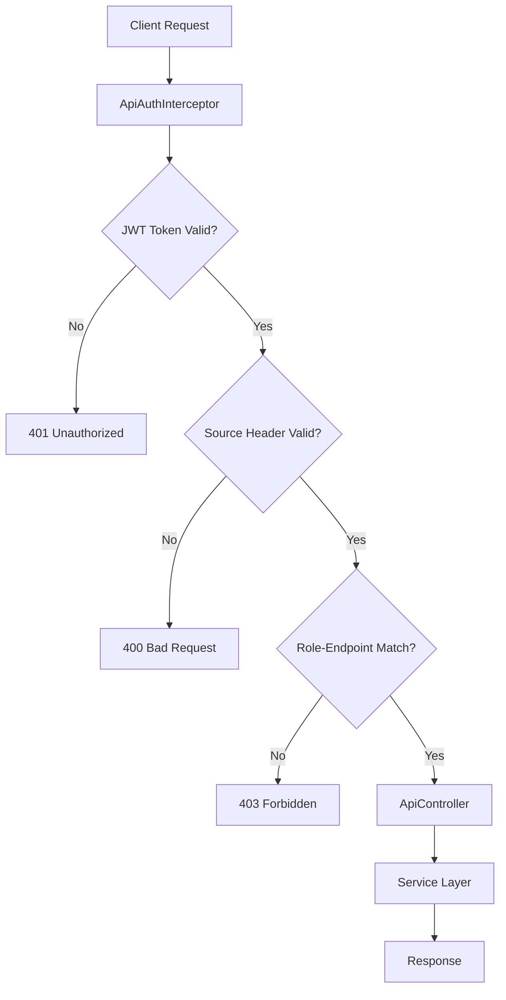

# 🔐 API Middleware - Keycloak Güvenlik Duvarı

<div align="center">


*Güvenli ve esnek API erişim kontrolü için Keycloak tabanlı middleware çözümü*

</div>

---

## 📋 İçindekiler

- [🎯 Proje Hakkında](#-proje-hakkında)
- [✨ Özellikler](#-özellikler)
- [🏗️ Mimari](#️-mimari)
- [🚀 Kurulum](#-kurulum)
- [⚙️ Yapılandırma](#️-yapılandırma)
- [📖 API Kullanımı](#-api-kullanımı)
- [🔧 Test Etme](#-test-etme)
- [📁 Proje Yapısı](#-proje-yapısı)
- [🤝 Katkıda Bulunma](#-katkıda-bulunma)

---

## 🎯 Proje Hakkında

Bu proje, **Keycloak** kimlik doğrulama sistemi ile entegre çalışan güvenli bir API middleware'idir. Farklı rol türlerindeki kullanıcıların (Supplier ve Market) belirli API endpoint'lerine erişimini kontrol eder ve güvenli bir API gateway görevi görür.

### 🎭 Rol Tabanlı Erişim Kontrolü

- **Supplier Rolü**: Supplier paneline özel işlemler
- **Market Rolü**: Market paneline özel işlemler
- **Çoklu Güvenlik Katmanı**: JWT token + Header bazlı doğrulama

---

## ✨ Özellikler

### 🔒 Güvenlik
- **JWT Token Doğrulama**: Keycloak tabanlı token kontrolü
- **Rol Bazlı Yetkilendirme**: Source header ile rol doğrulama
- **Endpoint Koruma**: URL bazlı erişim kontrolü
- **Detaylı Hata Yönetimi**: Anlamlı hata mesajları

### 🏭 Modüler Yapı
- **Interceptor Mimarisi**: İstek öncesi güvenlik kontrolleri
- **Service Layer**: İş mantığı ayrımı
- **Configuration Management**: Merkezi yapılandırma
- **Global Exception Handling**: Unified hata yönetimi

### 📊 API Endpoints
```
🔹 GET /api/supplier/listall     - Tüm tedarikçileri listele
🔹 GET /api/market/listall       - Tüm marketleri listele
```

---

## 🏗️ Mimari



---

## 🚀 Kurulum

### 📋 Gereksinimler

- **Java 17+**
- **Maven 3.9+**
- **Keycloak Server** (Port: 8180)
- **IDE** (IntelliJ IDEA, VS Code vb.)

### 🔽 Adım Adım Kurulum

1. **Projeyi klonlayın**
   ```bash
   git clone <repository-url>
   cd API-Middleware
   ```

2. **Bağımlılıkları yükleyin**
   ```bash
   mvn clean install
   ```

3. **Keycloak sunucusunu başlatın**
   ```bash
   # Keycloak sunucunuz 8180 portunda çalışıyor olmalı
   ```

4. **Uygulamayı çalıştırın**
   ```bash
   mvn spring-boot:run
   ```

---

## ⚙️ Yapılandırma

### 🔧 application.properties

```properties
# Sunucu Ayarları
server.port=8080
spring.application.name=API-Middleware-Wall

# Keycloak OAuth2 Ayarları
spring.security.oauth2.resourceserver.jwt.jwk-set-uri=http://localhost:8180/realms/api-middleware/protocol/openid-connect/certs
spring.security.oauth2.resourceserver.jwt.issuer-uri=http://localhost:8180/realms/api-middleware

# Keycloak Client Ayarları
keycloak.auth-server-url=http://localhost:8180
keycloak.realm=api-middleware
keycloak.resource=api-middleware-client
keycloak.credentials.secret=YOUR_CLIENT_SECRET

# API Yapılandırması
api.base-path=/api
```

### 🎭 Keycloak Realm Yapılandırması

1. **Realm Oluşturun**: `api-middleware`
2. **Client Oluşturun**: `api-middleware-client`
3. **Kullanıcı Rolleri**:
   - `Supplier` rolü
   - `Market` rolü
4. **Test Kullanıcıları**:
   - `supplier_user` (password: `supplier`)
   - `market_user` (password: `market`)

---

## 📖 API Kullanımı

### 🔑 Token Alma

#### Supplier Token
```bash
curl -X POST "http://localhost:8180/realms/api-middleware/protocol/openid-connect/token" \
  --header "Content-Type: application/x-www-form-urlencoded" \
  --data-urlencode "client_id=api-middleware-client" \
  --data-urlencode "client_secret=YOUR_CLIENT_SECRET" \
  --data-urlencode "grant_type=password" \
  --data-urlencode "username=supplier_user" \
  --data-urlencode "password=supplier"
```

#### Market Token
```bash
curl -X POST "http://localhost:8180/realms/api-middleware/protocol/openid-connect/token" \
  --header "Content-Type: application/x-www-form-urlencoded" \
  --data-urlencode "client_id=api-middleware-client" \
  --data-urlencode "client_secret=YOUR_CLIENT_SECRET" \
  --data-urlencode "grant_type=password" \
  --data-urlencode "username=market_user" \
  --data-urlencode "password=market"
```

### 📋 API Çağrıları

#### Supplier Endpoint'i (✅ Supplier Rolü)
```bash
curl -X GET "http://localhost:8080/api/supplier/listall" \
  --header "Authorization: Bearer SUPPLIER_TOKEN" \
  --header "Source: Supplier"
```

#### Market Endpoint'i (✅ Market Rolü)
```bash
curl -X GET "http://localhost:8080/api/market/listall" \
  --header "Authorization: Bearer MARKET_TOKEN" \
  --header "Source: Market"
```

### ⚠️ Hata Senaryoları

| Durum | HTTP Kodu | Mesaj |
|-------|-----------|-------|
| Token yok/geçersiz | `401` | "Hatalı token girildi" |
| Source header yok | `400` | "Kullanıcı rolü belirtilmemiş" |
| Geçersiz rol | `400` | "Kullanıcı rolü 'Supplier' veya 'Market' olmalıdır" |
| Rol uyuşmazlığı | `403` | "Bu panele sadece X rolü erişebilir" |

---

## 🔧 Test Etme

### 🧪 Postman Collection

Proje ile birlikte `Postman Komutları.txt` dosyasında hazır test komutları bulunmaktadır.

### 🔍 Test Senaryoları

1. **✅ Başarılı Senaryo**: Doğru token + doğru rol
2. **❌ Token Hatası**: Geçersiz/eksik token
3. **❌ Header Hatası**: Eksik Source header
4. **❌ Rol Hatası**: Yanlış endpoint erişimi

### 📊 Log Monitoring

Uygulama detaylı loglama yapar:
```properties
logging.level.org.springframework.security=DEBUG
logging.level.com.api.middleware.config=DEBUG
```

---

## 📁 Proje Yapısı

```
📦 API Middleware
├── 📄 pom.xml                          # Maven yapılandırması
├── 📄 README.md                        # Proje dokümantasyonu
├── 📄 Postman Komutları.txt           # Test komutları
└── 📁 src/main/
    ├── 📁 java/com/api/middleware/
    │   ├── 📄 MiddlewareApplication.java    # Ana uygulama
    │   ├── 📁 config/                       # Yapılandırma sınıfları
    │   │   ├── 🔒 ApiAuthInterceptor.java   # Güvenlik interceptor
    │   │   ├── ⚙️ SecurityConfig.java       # Spring Security config
    │   │   ├── 🌐 WebConfig.java            # Web yapılandırması
    │   │   └── 🔧 GlobalExceptionHandler.java
    │   ├── 📁 controller/
    │   │   └── 🎮 ApiController.java        # REST endpoints
    │   ├── 📁 model/
    │   │   ├── 🏪 Market.java               # Market modeli
    │   │   └── 📦 Supplier.java             # Supplier modeli
    │   └── 📁 service/
    │       ├── 🏪 MarketService.java        # Market servisi
    │       └── 📦 SupplierService.java      # Supplier servisi
    └── 📁 resources/
        └── ⚙️ application.properties        # Uygulama ayarları
```

---

## 🛡️ Güvenlik Özellikleri

### 🔐 Çoklu Güvenlik Katmanı

1. **JWT Token Doğrulama**
   - Keycloak ile imzalanan tokenlar
   - Token süresi kontrolü
   - Issuer doğrulaması

2. **Header Bazlı Rol Kontrolü**
   - `Source` header zorunluluğu
   - Rol-endpoint uyumluluk kontrolü
   - Büyük/küçük harf duyarlılığı

3. **URL Bazlı Erişim Kontrolü**
   - Endpoint-rol eşleştirmesi
   - Pattern matching güvenlik
   - Dinamik yetkilendirme

### 🔒 Güvenlik En İyi Uygulamaları

- ✅ Hassas bilgilerin loglanmaması
- ✅ Detaylı hata mesajlarının client'a gönderilmemesi
- ✅ Token'ların güvenli saklanması
- ✅ CORS yapılandırması
- ✅ Rate limiting hazırlığı

---

## 🤝 Katkıda Bulunma

1. **Fork** edin
2. **Feature branch** oluşturun (`git checkout -b feature/amazing-feature`)
3. **Commit** edin (`git commit -m 'Add some amazing feature'`)
4. **Push** edin (`git push origin feature/amazing-feature`)
5. **Pull Request** açın

---

## 📞 İletişim

**Proje Sahibi**: Deniz Barış YILDIRIM
**Email**: denizbarisyi@gmail.com
**LinkedIn**: denizbarish

---

<div align="center">

### 🌟 Bu projeyi beğendiyseniz yıldız vermeyi unutmayın!

**Made with ❤️ using Spring Boot & Keycloak**

</div>
